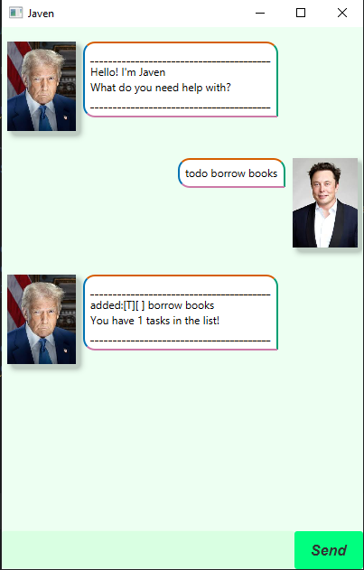

# Javen




Javen is your friendly virtual task assistant, designed to help you stay organized on top of your daily activities.
With a simple set of commands, you can quickly add tasks, mark them as done, remove them, or find exactly what you need. 
Javen is your go-to companion for task management, keeping you stress-free and productive!

## Getting Started
Upon launching the application, you will be greeted by Javen!

## Adding ToDos: todo
Create a task with a description
Format: todo /DESCRIPTION
Example: todo borrow books

```
Output:
________________________________________
added:[T][ ] borrow books
You have 1 tasks in the list!
________________________________________
```

## Adding deadlines
Create task with given deadline. Datetime should be formatted as such: yyyy-MM-dd HHmm

Format: deadline /DESCRIPTION /DEADLINE
Example: deadline return book /by 2022-01-01 1800
Output:

```
________________________________________
added:[D][ ] return book by: Jan 1 2022 18:00
You have 1 tasks in the list!
________________________________________

```

## Adding events
Create task with start datetime and end datetime. Date should be formatted as such: yyyy-MM-dd HHmm

Format: deadline /DESCRIPTION /START_DATE /END_DATE
Example: event project meeting /from 2022-01-01 1900 /to 2022-01-01 2000
Output:

```
________________________________________
added:[E][ ] project meeting from: Jan 1 2022 19:00 to: Jan 1 2022 20:00
You have 3 tasks in the list!
________________________________________
```


## Show all tasks
Display all task in task list

Format: list
Output:

```
________________________________________
These are your tasks!
1. [T][ ] borrow books
2. [D][ ] return book by: Jan 1 2022 18:00
3. [E][ ] project meeting from: Jan 1 2022 19:00 to: Jan 1 2022 20:00
________________________________________
```


## Mark Tasks
Marks tasks as completed

Format: mark /TASK_ID
Example: mark 1
Output:

```
________________________________________
Task is marked!
[T][X] borrow books
________________________________________
```

## Unmark Tasks
Marks tasks as uncompleted

Format: unmark /TASK_ID
Example: unmark 1
Output:

```
________________________________________
Task is unmarked!
[T][] borrow books
________________________________________
```

## Delete Tasks
Remove task from task list

Format: delete /TASK_ID
Example: delete 1
Output:

```
________________________________________
Task is deleted!
[T][X] borrow books
________________________________________
```


## Find Tasks
Search for task given a keyword

Format: find /KEYWORD
Example: find books
Output:

```
________________________________________
Task found!
[T][] borrow books
________________________________________
```


## Exit Application
Prints greeting and exit the application

Format: bye
Output:

```
________________________________________
Bye! See you soon :)
________________________________________
```